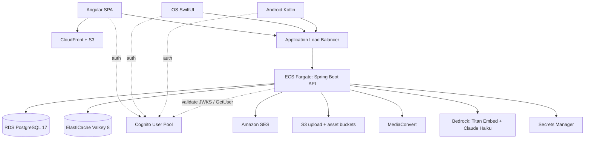

# Simplicity — Digital Health App Architecture

Clinical training platform for delivering a digital therapeutic to people living with serious mental
illness. Spring Boot API, Angular web, native iOS and Android, deployed on AWS in `ap-southeast-2`.

For phase-by-phase design rationale, see [superpowers/specs/](superpowers/specs/) — starting with
[Phase 1](superpowers/specs/2026-08-29-digital-health-app-phase1-design.md).

---

## 1. Overview

### What it is

**Simplicity** certifies mental health clinicians to safely deliver a digital therapeutic to people
living with schizophrenia and psychosis. Training content is **not shipped with the product** — each
organisation's administrators author modules (markdown sections, optional video, quiz), assign them
to teams, and a clinician completes a module by reading every section and passing the quiz.

| Tab | Purpose |
| --- | --- |
| **Dashboard** | Next outstanding module |
| **Learn** | Assigned modules, section reader, video, quiz, assistant ask box |
| **Reflect** | Private journal with full-text search |
| **Settings** | Profile; org admin (members, teams, invitations, module authoring) |

### Repository layout

| Directory | Contents |
| --- | --- |
| `backend/` | Spring Boot 4.1 API — Java 17, Gradle |
| `web/` | Angular 22 SPA |
| `ios/` | SwiftUI client — 10 local SPM packages |
| `android/` | Kotlin client — 12 Gradle modules (shell incomplete) |
| `api-contract/` | Generated `openapi.yaml` + OpenAPI Generator config |
| `infra/` | CloudFormation templates, bootstrap/teardown |
| `scripts/` | Production verification suites (Python) |
| `local/` | Floci provisioning for local Cognito/SES |
| `docs/` | Design specifications and this document |

A **monorepo** so one pull request can change the API contract and every consumer together. CI
regenerates Angular, Swift, and Kotlin clients and fails on drift.

### Runtime topology



Clients sign in against Cognito directly (SRP). The API never sees a password.

### Authenticated request path

| # | Step | Where |
| --- | --- | --- |
| 1 | `Authorization: Bearer <access token>` | Client (15 min Cognito access token) |
| 2 | ALB terminates TLS, forwards to 8080 | ALB |
| 3 | JWT verified: signature, `exp`, `iss`, `token_use == "access"`, `client_id` in allowlist | `SecurityConfig` |
| 4 | Denylist check: reject if token `iat` precedes revocation instant | `TokenRevocationService` / Redis |
| 5 | Principal resolved (user id, org roles, team roles) | `CachingPrincipalService` → Redis `principal:{sub}`, 5 min TTL |
| 5a | First request: JIT provision `app_user` via Cognito `GetUser` (email not in token) | `UserProvisioningService` |
| 6 | `@PreAuthorize("@authz.…")` | `AuthorizationService` |
| 7 | Business rules, audit, rate limits | `service/` |
| 8 | Response or RFC 9457 `application/problem+json` | `GlobalExceptionHandler` |

---

## 2. Backend

**Entry:** `io.simplicity.training.TrainingApplication`  
**Stack:** Spring Boot 4.1.1, Java 17, Gradle, single deployable module (~140 Java classes)

### Package layout (layered, not feature-sliced)

| Package | Role |
| --- | --- |
| `controller/` | 9 `@RestController` classes — thin, `@PreAuthorize` here |
| `service/` | Business logic, transactions, audit, rate limits; `assistant/`, `media/` sub-packages |
| `repository/` | 19 Spring Data `JpaRepository` interfaces; native SQL for tsvector/pgvector |
| `security/` | Filter chain, `AppPrincipal`, cache, revocation, `@authz`, Cognito directory |
| `model/` | 18 `@Entity` classes, enums, request/response DTO records |
| `config/` | `AppProperties`, AWS SDK clients, scheduling |
| `exception/` | 5 runtime exceptions + `@RestControllerAdvice` |

Domain boundaries live in URLs: `/api/v1/orgs/{orgId}/…`

### Controllers and API surface

#### `CurrentUserController` — `/api/v1/me`

| Method | Path | Auth |
| --- | --- | --- |
| GET | `/me` | Authenticated — provisions on first call |
| PUT | `/me/profile` | Authenticated |
| PUT | `/me/active-organisation` | Authenticated |

#### `OrganisationController`

| Method | Path | Auth |
| --- | --- | --- |
| POST | `/organisations` | Any authenticated user; creator → `ORG_ADMIN` |
| GET | `/orgs/{orgId}` | Org member |
| GET | `/orgs/{orgId}/members` | Org member |
| PATCH | `/orgs/{orgId}/members/{userId}` | Org admin |
| DELETE | `/orgs/{orgId}/members/me` | Org member (leave) |
| DELETE | `/orgs/{orgId}/members/{userId}` | Org admin (refuses last admin) |
| DELETE | `/orgs/{orgId}` | Org admin (archive) |

#### `TeamController` — `/api/v1/orgs/{orgId}/teams`

CRUD teams; list/add/remove members. `@authz.canManageTeam` for team-level admin actions.

#### `InvitationController`

| Method | Path | Auth |
| --- | --- | --- |
| GET/POST | `/orgs/{orgId}/invitations` | Org admin |
| DELETE | `/orgs/{orgId}/invitations/{id}` | Org admin |
| GET | `/invitations/{token}` | **Public** preview |
| POST | `/invitations/{token}/accept` | Authenticated |

Raw invitation token emailed once; only SHA-256 hash stored. Redis index `invite:{tokenHash}`.

#### `ModuleController` — class-level `@authz.isOrgAdmin`

Create/list/get/patch/archive modules; open draft; replace sections/quiz; publish (optional
`supersedesCompletions`); assign teams.

#### `LearningController` — class-level `@authz.isOrgMember`

List assigned modules; read module; get quiz; submit attempts (unlimited retakes); complete
sections; presigned playback URL (15 min TTL). Assignment gate: module must be assigned to a team
the user belongs to.

#### `MediaController` — org admin

Register upload → presigned PUT → `/uploaded` triggers MediaConvert; list/delete; PUT/DELETE WebVTT
captions.

#### `ReflectionController` — `/api/v1/me/reflections`

Owner-only CRUD + `?q=` full-text search. No `org_id` — survives leaving an organisation. Other
users' entries return **404**, not 403.

#### `AssistantController`

`POST /api/v1/orgs/{orgId}/assistant/questions` — single-turn RAG over published org content.

### Module lifecycle

| Stage | State | Learners |
| --- | --- | --- |
| Create | `module` row, no version | Invisible |
| Open draft | `module_version` `DRAFT` (one per module, partial unique index) | Invisible |
| Publish | `module_version` `PUBLISHED` (immutable) | Visible if team-assigned |
| Republish + `supersedesCompletions` | New published version | Prior completions → `NEEDS_REDOING` |
| Archive | `module.archived_at` set | Hidden from Learn and retrieval |

### Video pipeline

1. Admin registers asset (`MediaService.register`, rate limit 1/user/minute)
2. Presigned PUT to upload bucket; client uploads directly (max 500 MB)
3. Client calls `/uploaded` → MediaConvert job (720p H.264/AAC)
4. `MediaConvertPoller` every 30s advances `PROCESSING` → `READY` / `FAILED`
5. Source object expires after 7 days (S3 lifecycle)
6. Learner gets presigned GET from asset bucket

### Assistant (RAG)

1. `ModuleIndexer` every 60s embeds published versions missing `indexed_at` (Titan Embed v2, 1024-d)
2. Question embedded; 6 nearest chunks within org (pgvector HNSW, cosine distance)
3. If nearest distance > **0.55** → `answered: false`, **no model call**
4. Else Claude Haiku 4.5 via `au.` inference profile (Australian regions only)
5. Citations include whether module is assigned to caller

**Privacy:** No code path from reflections to assistant. iOS/Android enforce package/module boundary.

### Scheduled jobs

| Job | Schedule | Purpose |
| --- | --- | --- |
| `MediaConvertPoller` | `fixedDelay = PT30S` | Transcode status |
| `ModuleIndexer` | `fixedDelay = PT60S` | Embed new published versions |
| `AuditRetentionJob` | `cron = 0 15 3 * * *` | Null `audit_event.ip_address` after 180 days |

No `@Async`, no SQS — all run in the API container (scale-out needs advisory lock for pollers).

### Errors

RFC 9457 `application/problem+json` via `GlobalExceptionHandler`:

| Exception | HTTP |
| --- | --- |
| `BadRequestException` | 400 |
| `ForbiddenException` / `AccessDeniedException` | 403 |
| `NotFoundException` | 404 |
| `ConflictException` | 409 |
| `EmailDeliveryException` | 503 |

### Tests

- **`AbstractIntegrationTest`:** Full app + Testcontainers `pgvector/pgvector:pg17` + Valkey; locally signed JWTs with production-identical validator
- **`AwsContractTest`:** Real SDK against Floci (Cognito/SES contract)
- **`OpenApiSpecTest`:** Committed `openapi.yaml` drift check

---

## 3. Data model

Flyway owns schema (`ddl-auto: none`). Eight migrations:

| Version | Adds |
| --- | --- |
| V1 | `citext`; org, user, membership, team, invitation, audit |
| V2 | Org archiving; `app_user.active_org_id` |
| V3 | Modules, versions, sections, assignments, progress |
| V4 | Quiz questions, options, attempts |
| V5 | `media_asset`; section `media_asset_id` |
| V6 | `media_asset.caption_key` |
| V7 | `reflection` + generated `TSVECTOR` + GIN |
| V8 | `vector` extension; `module_chunk`; `module_version.indexed_at` |

### Key relationships

```
organisation ──< org_membership >── app_user
organisation ──< team ──< team_member >── app_user
organisation ──< module ──< module_version ──< module_section, quiz_question ──< quiz_option
module ──< team_module_assignment >── team
app_user ──< user_section_progress, user_module_completion, quiz_attempt, reflection
organisation ──< module_chunk (VECTOR(1024))
organisation ──< audit_event
```

### Postgres features

| Feature | Use |
| --- | --- |
| `citext` | Case-insensitive unique email (+ app-level lowercasing for Hibernate lookups) |
| `tsvector` + GIN | Reflection search |
| `pgvector` + HNSW | Assistant retrieval (vs Neptune at $200–700/mo) |
| `jsonb` | `audit_event.metadata` |
| Partial unique indexes | One pending invitation per (org, email); one DRAFT per module |

### Retention

| What | Kept for |
| --- | --- |
| Reflections | Life of account |
| Audit entries | Indefinitely (operational history) |
| Audit IP address | **180 days** (`app.audit.ip-retention`) |
| Principal cache | 5 minutes |
| Revoked sessions | 15 minutes (access token lifetime) |
| Uploaded source video | 7 days (S3 lifecycle) |

---

## 4. Identity and security

### Cognito vs application database

| Cognito | Application DB |
| --- | --- |
| Passwords, verification, reset, (future) MFA | Profile, memberships, roles |
| Issues access tokens (15 min) and refresh tokens | `app_user.cognito_sub` links accounts |

Custom sign-in screens on every client — not Cognito Hosted UI.

### JWT validation

Beyond signature/expiry:

- `iss` — correct pool
- `token_use == "access"` — reject ID tokens
- `client_id` ∈ **`app.cognito.client-ids`** (web, iOS, Android — list, not single value)

Email resolved via Cognito **`GetUser`**, not JWT claims (production pools differ from local Floci).

### Revocation

Denylist stores **revocation instant**; filter rejects tokens with earlier `iat`. A boolean ban would
lock out multi-org clinicians from all orgs.

| Event | Cache | Denylist |
| --- | --- | --- |
| Remove member, leave, archive org, deactivate | Evict | Write |
| Role change (admin → member) | Evict | Not written (intentional) |

Clients retry once on 401 with forced token refresh (Amplify does not refresh on rejection).

### Authorisation tiers

| Tier | Storage | Values |
| --- | --- | --- |
| Platform | `app_user.platform_role` | `SUPER_ADMIN`, `STANDARD` |
| Organisation | `org_membership.org_role` | `ORG_ADMIN`, `ORG_MEMBER` |
| Team | `team_member.team_role` | `TEAM_ADMIN`, `TEAM_MEMBER` |

Two layers: `@PreAuthorize` on controllers + `org_id` filter in every org-scoped repository query.

### Redis (Valkey)

| Key | Purpose | TTL |
| --- | --- | --- |
| `principal:{sub}` | Serialised `AppPrincipal` | 5 min |
| `denylist:{sub}` | Revocation epoch | 15 min |
| `invite:{tokenHash}` | Invitation UUID | 7 days |
| `ratelimit:{scope}:{key}` | Fixed-window counter | Window duration |

### Rate limits

| Scope | Limit | Window | Redis down |
| --- | --- | --- | --- |
| `invite` | 50/org | 1 hour | **REFUSE** |
| `assistant` | 30/user | 1 hour | ALLOW |
| `reflection-write` | 60/user | 1 hour | ALLOW |
| `media-register` | 1/user | 1 minute | **REFUSE** |

### Client token storage

| Client | Storage |
| --- | --- |
| Web | `sessionStorage` (tab close = session end) |
| iOS / Android | Amplify SDK → Keychain / Keystore |

---

## 5. Clients

### Contract generation

```bash
cd backend && ./gradlew generateOpenApiSpec   # → api-contract/openapi.yaml
cd api-contract && npm run generate:web       # → web/src/app/api/
cd api-contract && npm run generate:ios       # → ios/Packages/SimplicityApi/.../Generated/
cd api-contract && npm run generate:android   # → android/api-client/
```

OpenAPI Generator **7.25.0**. CI `clients` job fails on any drift.

### Web (Angular 22)

- Standalone components, signals + RxJS at HTTP boundary, Vitest
- **`main.ts`** fetches `config.json` before bootstrap (not `APP_INITIALIZER`)
- **`SessionService`** caches `GET /me`; guards enforce server-authoritative onboarding
- **`authInterceptor`:** Bearer token; 401 → sign out; skips auth on public invitation preview
- Video: native `<video>` + WebVTT `<track>`; section-level progress only
- Assistant: ask box on Learn tab (not a fifth tab)

**Routes:** auth (`/sign-in`, …), onboarding (`/welcome/*`), shell with Dashboard / Learn /
Reflect / Settings (admin sub-routes under `/settings/*` with `orgAdminGuard`).

### iOS (SwiftUI, iOS 17+)

Ten SPM packages; app target is thin (`Simplicity_iOS/`):

```
Foundation, Design, Api → Services → Auth, Learn, Reflect, Assistant, Admin
```

Feature packages **never depend on each other** (Reflect ↔ Assistant isolation).

- DI: Factory; ViewModels: `@Observable @MainActor`
- Navigation: `AppRouter` stage machine → `MainTabView` (4 tabs); assistant as sheet from Learn
- API: generated client + `BearerInterceptor` (401 retry, 2s throttle)
- Config: build-time xcconfig (`APIBaseURL`, Cognito ids) — not runtime
- **Captions:** AVFoundation cannot side-load WebVTT on progressive MP4; points user to web/Android
- Tests: Swift Testing per package; `test-all.sh`; UI smoke + optional live Cognito test
- Release: fastlane TestFlight (pending explicit bundle id registration)

### Android (Kotlin, Compose)

Twelve Gradle modules — **more complete than root README suggests**:

| Module | State |
| --- | --- |
| `api-client`, `api`, `foundation`, `design`, `testing` | Complete |
| `services` | 6 services — **no `SessionService` yet** |
| `auth` | Sign-in screen + Amplify; no sign-up/wizards |
| `learn`, `reflect`, `assistant`, `admin` | ViewModels + tests only; **no Compose screens** |
| `app` | **`MainActivity` shows sign-in only**; feature modules not wired |

- DI: Hilt (only `AuthModule` so far)
- Video: Media3 ExoPlayer with WebVTT captions in `VideoSection`
- `ModuleBoundaryTest` asserts assistant does not depend on reflect

---

## 6. Infrastructure

**Region:** `ap-southeast-2` · **Domain:** `simplicityhelp.com`  
**Endpoints:** `app.simplicityhelp.com` (web), `api.simplicityhelp.com` (API)

### CloudFormation stacks (dependency order)

```
deploy-role (bootstrap)
network → (data ∥ auth) → web → media → app
```

| Stack | Contents |
| --- | --- |
| `network` | VPC `10.20.0.0/16`, public subnets, SG chain: internet → ALB → app:8080 → data:5432/6379 |
| `data` | RDS Postgres 17.7 `db.t4g.micro`, Valkey 8 `cache.t4g.micro`, Secrets Manager |
| `auth` | Cognito pool (`Retain`), 3 app clients, no hosted UI |
| `web` | S3 + CloudFront OAC, SPA fallback, security headers |
| `media` | Upload bucket (7-day expiry), asset bucket (`Retain`), MediaConvert queue + role |
| `app` | ECR, ECS Fargate ARM64 (0.5 vCPU / 1 GB), ALB, SES config set, SNS alarms |
| `deploy-role` | GitHub OIDC → IAM deploy role |

Optional **`box`** stack: single `t4g.small` EC2 with Docker Compose (Caddy + app + Postgres +
Valkey), nightly `pg_dump` to S3 — ~$23/mo demo topology.

### Cost and deliberate deviations

| Topology | ~Cost/mo |
| --- | --- |
| Full (Fargate + ALB + RDS + Valkey) | $70–85 |
| Box (EC2) | $23 |
| Paused (`teardown.sh --pause`) | $0.70 |

- **Public subnets, no NAT** (~$32/mo saved); SG restricts app to ALB only
- **No staging environment** — everything verified against production

### CI/CD (`.github/workflows/ci.yml`)

| Job | When | Does |
| --- | --- | --- |
| `backend` | Always | `./gradlew test` |
| `clients` | After backend | Regenerate all clients; fail on diff |
| `web` | Always | build + test |
| `ios` | Path filter | SwiftLint, `test-all.sh`, UI smoke |
| `android` | Always | `./gradlew test`, `:app:assembleDebug` |
| `deploy` | Push to `main` | OIDC, ARM64 image, deploy `app` + `web`, smoke check |

Only **`app`** and **`web`** redeploy on CI; infra stacks are bootstrap-time.

### Production verification (`scripts/`)

Python suites using real Cognito (`verification.py` harness): hardening, iOS sign-in, learn,
authoring, org admin, reflect/assistant. Creates `verify-*@simplicityhelp.com` accounts; cleanup
tracks only what it created (never lists the pool).

### Local development

```bash
docker compose up -d    # Postgres 5432, Valkey 6379, Floci 4566 (Cognito + SES only)
./local/bootstrap.sh    # → backend/.env.local, web/public/config.json
```

Re-run bootstrap after `docker compose down` (Floci state is in-memory).

**Floci gotchas:** tokens carry `email` claim; `GetUser` omits `email_verified` — tests must not
relax checks that production requires.

---

## 7. Decisions and known gaps

### Key decisions

| Decision | Rationale | Cost |
| --- | --- | --- |
| Cognito for auth | Avoid password reset/MFA × 3 clients | Lock-in; only `cognito_sub` couples schema |
| Custom sign-in UI | Clinical trust / brand | More client code |
| Monorepo | Contract + consumers move together | Single CI |
| Org membership as join table | Multi-org clinicians (locums) | Active-org concept everywhere |
| pgvector not Neptune | Cost at this scale | Testcontainers use pgvector image |
| Assistant threshold before LLM | Safety in mental health context | Unanswerable questions cost nothing |
| Async indexing | Publish must not depend on Bedrock | ~1 min staleness |
| Last admin leave archives org | No orphaned admin-less org | Surprising UX; corrected in iOS warning |

### Phase status

| Phase | Scope | State |
| --- | --- | --- |
| 1 | Auth, orgs, teams, invitations, AWS | Shipped |
| 2 | Modules, video, quizzes, Learn | Shipped |
| 3 | Reflect journal | Shipped |
| 4 | Assistant | Shipped |
| 5 iOS | Native client | Shipped; TestFlight pending bundle id |
| 5 Android | Native client | **Partial** — logic/tests exist, no app shell |
| — | Hardening | Shipped |

### Known gaps

| Gap | Notes |
| --- | --- |
| **Android shell** | Only item falling short of Phase 1 promise |
| **No staging** | Right next infra decision per specs |
| **iOS captions** | Needs HLS transcode; web/Android work today |
| **Valkey TLS in transit** | Deferred; traffic stays in VPC |
| **Auth events not audited** | Org/team/module changes are |

### Compliance posture

Reflections are de-identified by design (clinician practice notes, no patient identifiers) — outside
HIPAA/HISO territory. Groundwork: encryption at rest/transit, audit on membership mutations,
least-privilege IAM. If de-identification constraint relaxes, reassess **before** adding features
like "help me reflect on this" (would break the promise that reflections are never read by the
server or sent to Bedrock).

---

## Quick reference

| Item | Value |
| --- | --- |
| API base (prod) | `https://api.simplicityhelp.com` |
| Web (prod) | `https://app.simplicityhelp.com` |
| Local API | `http://localhost:8080` |
| Local web | `http://localhost:4200` |
| Node | 24.20.0 (`.nvmrc`) |
| Java | 17 (Amazon Corretto) |

See also: [README.md](../README.md), [infra/README.md](../infra/README.md),
[api-contract/README.md](../api-contract/README.md).
