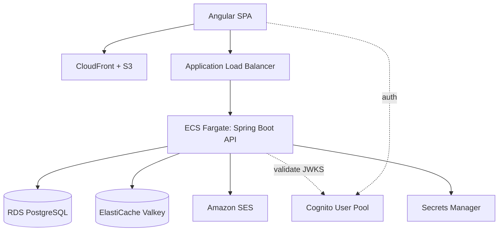
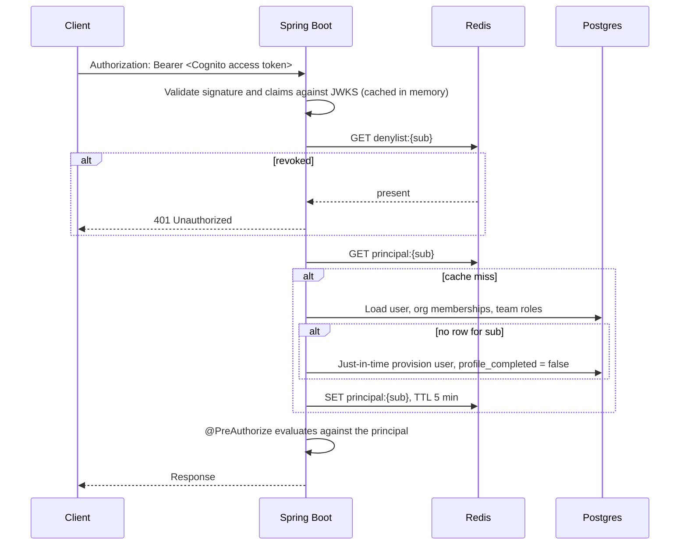
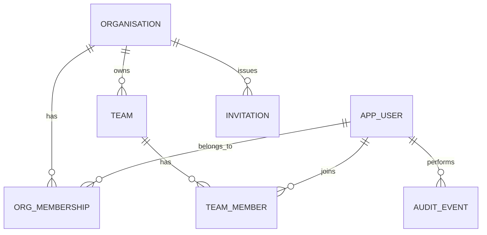
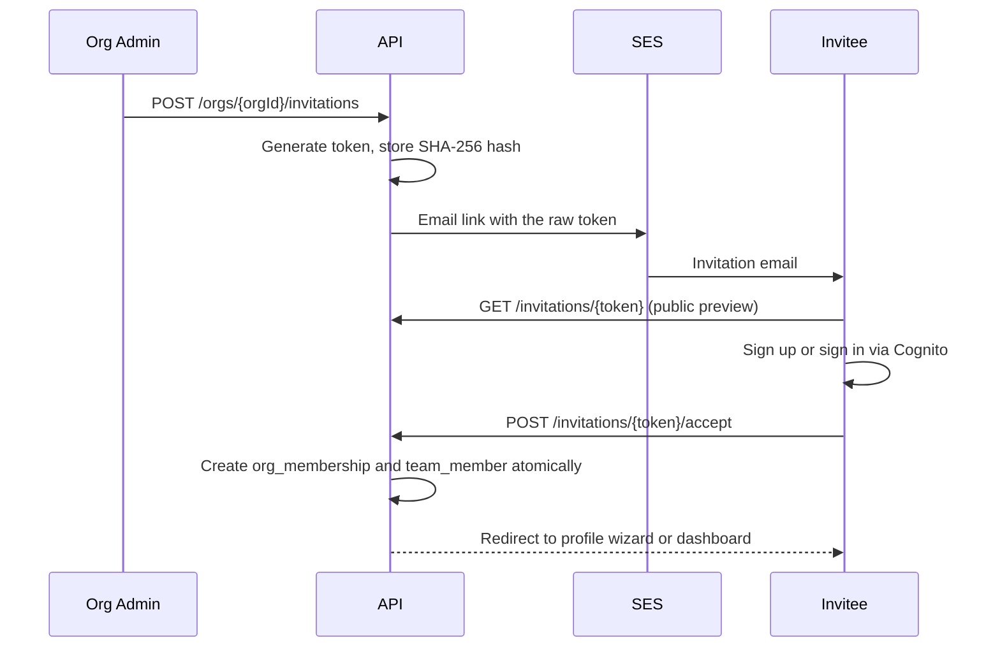

# Digital Health App — Phase 1 Design: Foundation, Identity, and Teams

Date: 2026-08-29
Status: Approved for implementation

## 1. Product context

The Digital Health App is a digital training package that teaches mental health professionals to
safely deliver **Simplicity**, a digital therapeutic tool, to people living with serious mental
illness such as schizophrenia and psychosis.

The application has four tabs:

| Tab | Purpose |
| --- | --- |
| Dashboard | The module the clinician is currently working on, plus completed modules |
| Learn | Searchable tiles of training modules to select and work through |
| Reflect | A searchable journal of practice reflections |
| Settings | The clinician's own professional profile |

Training content is not shipped with the product. Administrators author modules — an explanation of
the topic plus quiz questions — and a module counts as complete only when every question has been
answered correctly. Administrators also create teams and invite colleagues into them.

## 2. Phasing

The full product spans five subsystems that are too large for a single design. Each phase gets its
own spec; this document covers Phase 1 only.

| Phase | Scope |
| --- | --- |
| **1 (this spec)** | Monorepo, backend foundation, Cognito authentication, first-login profile capture, organisations, teams, invitations, three-tier roles, Angular walking skeleton, deployed AWS environment |
| 2 | Admin module authoring, quiz engine, learner Dashboard and Learn tabs, progress tracking |
| 3 | Reflect journal with full-text search |
| 4 | AI assistant with knowledge of the training package |
| 5 | Native iOS (Swift) and Android (Kotlin) clients, hardening |

### Phase 1 definition of done

A clinician can sign up or accept an emailed invitation, complete their professional profile, and
see the four-tab shell. An organisation administrator can create teams, invite colleagues, assign
team roles, and revoke access. All of it runs on real AWS infrastructure deployed from
CloudFormation by a GitHub Actions pipeline. Dashboard, Learn, and Reflect are deliberately empty.

## 3. Decisions and their rationale

### 3.1 Reference codebases

Two existing repositories in this workspace informed the design.

Both live outside this repository, in the sibling workspace directories `personal/wombat-server`
and `tinderbox2_server`.

`wombat-server` is the structural template: Spring Boot on Java 17 with `controller` / `service` /
`repo` / `model` / `security` packages, Postgres with Flyway migrations, and MockMvc integration
tests that log in for real. Four of its weaknesses are deliberately not carried across:

1. Its JWT signing key is generated in `JwtService`'s constructor, so every restart silently
   invalidates all tokens. Phase 1 avoids the problem entirely by not signing its own tokens.
2. It has no refresh tokens.
3. It has no `@ControllerAdvice`, so failures surface as raw `RuntimeException`.
4. It returns JPA entities directly from controllers and hardcodes secrets in `docker-compose.yml`.

`tinderbox2_server` contributes two patterns rather than structure. Its invitation flow — create the user in an `INVITED` state, email a one-time token held
in Redis, exchange that token for a real session on activation — is adopted almost directly. Its
two-layer authorisation model, a coarse gate on the endpoint plus fine-grained resource permission
checks, is adopted in simplified form. Its opaque-Redis-token session model and its
`EndpointDefs.java` code-generation framework are **not** adopted; both solve problems of scale
this project does not have.

### 3.2 Platform

| Decision | Choice | Reasoning |
| --- | --- | --- |
| Language / runtime | Java 17 (Amazon Corretto) | The only JDK installed locally, and it matches `wombat-server` so reference code ports directly |
| Framework | Spring Boot 3.4 | Same as the reference template |
| Build | Gradle (Groovy DSL) | Matches the Moxion work repositories |
| Database | PostgreSQL 16 + Flyway | Same as `wombat-server`; Flyway owns the schema, `ddl-auto: none` |
| Cache | Redis / ElastiCache Valkey | Principal cache, revocation denylist, invitation tokens, rate limiting |
| Web client | Angular | Existing skill |
| Mobile clients | Native Swift and Kotlin | Deferred to Phase 5 |
| IaC | CloudFormation + SAM | Matches `moxion_pipeline` practice |
| Contract | Code-first OpenAPI via springdoc | Ordinary Spring code, with generated clients as a build artifact |

### 3.3 Repository layout

A monorepo, so that a single pull request can change the API contract and every consumer of it at
once. That matters most now, while the contract is still moving.

```
digital-health-app/
  backend/         Spring Boot API
  web/             Angular application
  infra/           CloudFormation and SAM templates
  api-contract/    Generated openapi.yaml and openapi-generator configuration
  docs/            Design specifications
  ios/  android/   Placeholders for Phase 5
```

### 3.4 Identity: why Cognito

AWS Cognito owns credentials, password reset, email verification, and (later) MFA. The application
database owns everything about who a person *is* within the product: their profile, organisation
memberships, and roles.

The alternative — self-managed JWT issuance in the style of `wombat-server` — was rejected because
it means writing and maintaining password reset, email verification, token refresh, and MFA three
times over once the native clients arrive.

The accepted cost is that Cognito owns the user store, so migrating away later would require users
to re-establish credentials. Nothing in the application schema depends on Cognito beyond the
`cognito_sub` column, which limits the blast radius.

**Custom login screens, not the Hosted UI.** Each client renders its own sign-up, confirmation,
sign-in, and forgot-password screens and calls Cognito's API directly. This costs more code per
client but keeps the product's visual identity intact throughout onboarding, which matters for a
clinical tool that must feel trustworthy.

### 3.5 What Redis is actually for

The original requirement was "JWT authentication with Redis caching the token." Cognito-issued
JWTs are validated offline against the pool's JWKS public keys, so there is no token lookup to
cache — that framing does not apply. Redis still earns its place, for four different jobs:

| Key pattern | Purpose | TTL |
| --- | --- | --- |
| `principal:{sub}` | The resolved application principal: user id, profile status, org memberships, team roles. Avoids a multi-table join on every request | 5 minutes |
| `denylist:{sub}` | Immediate revocation. Without it, deactivating a user leaves their access token valid for up to an hour | Access token lifetime |
| `invite:{tokenHash}` | One-time invitation tokens, mirroring `tinderbox2_server`'s activation tokens | 7 days |
| `ratelimit:{scope}:{key}` | Throttling invitation creation and sign-up | 1 minute window |

The 5-minute principal TTL is only safe because every role or membership mutation explicitly
evicts the affected users' cache entries. The TTL is a backstop against missed evictions, not the
primary correctness mechanism.

## 4. Architecture

### 4.1 Runtime topology



The browser talks to Cognito directly for authentication and to the API for everything else. The
API never sees a password.

### 4.2 The path of an authenticated request



Just-in-time provisioning means a user who authenticates against Cognito but has no application row
gets one created on first request. `GET /api/v1/me` returns a `profileCompleted` flag, and every
client routes to the profile wizard until it is true. Enforcing this server-side rather than by
client-side convention is what makes "gather details right after first login" reliable across three
independently developed clients.

### 4.3 Authorisation model

Three tiers, each stored in a different place because each has a different scope.

| Tier | Stored on | Values | Grants |
| --- | --- | --- | --- |
| Platform | `app_user.platform_role` | `SUPER_ADMIN`, `STANDARD` | Cross-organisation operational access |
| Organisation | `org_membership.org_role` | `ORG_ADMIN`, `ORG_MEMBER` | Manage the org, its teams and invitations, and (from Phase 2) its modules |
| Team | `team_member.team_role` | `TEAM_ADMIN`, `TEAM_MEMBER` | Manage that one team's membership |

When module authoring arrives in Phase 2, a `TEAM_ADMIN` will deliberately not be able to create or
delete modules. Authoring is an organisation-level capability, so that a team lead cannot delete
training content other teams depend on.

Enforcement has two layers, echoing `tinderbox2_server`:

1. **Declarative gate.** Org-scoped resources live under `/api/v1/orgs/{orgId}/...`, and methods
   carry `@PreAuthorize("@authz.isOrgAdmin(#orgId)")` or similar. Putting `orgId` in the path makes
   the tenant boundary explicit, checkable in one place, and straightforward to write negative
   tests against.
2. **Defence in depth.** Every org-scoped repository query also filters on `org_id`. A bug in the
   first layer then yields an empty result rather than another tenant's data.

### 4.4 Multi-tenancy

Organisation membership is a join table rather than a column on the user, so one clinician can
belong to several organisations. A locum working across two hospitals needs this, and so does
anyone who self-signs up to create their own organisation and is later invited into an existing
one. Retrofitting it after launch would mean migrating live membership data; adding it now costs
one table.

Clients hold an "active organisation" and pass its id in the path. The API validates membership on
every request rather than trusting the client's choice.

## 5. Data model



### 5.1 Tables

**`organisation`** — `id` (uuid pk), `name`, `slug` (unique), `organisation_type`
(`HOSPITAL` | `CLINIC` | `UNIVERSITY` | `COMPANY` | `OTHER`), `country`, `created_at`,
`updated_at`.

**`app_user`** — `id` (uuid pk), `cognito_sub` (unique, not null), `email` (unique, citext),
`full_name`, `phone`, `professional_role` (free text, e.g. "Clinical Psychologist"),
`platform_role`, `status` (`ACTIVE` | `INVITED` | `DEACTIVATED`), `profile_completed` (boolean),
`created_at`, `updated_at`.

**`org_membership`** — `user_id` + `org_id` composite pk, `org_role`, `status`, `joined_at`.

**`team`** — `id` (uuid pk), `org_id` (fk), `name`, `description`, `created_by`, `created_at`,
`updated_at`. Unique on `(org_id, name)`.

**`team_member`** — `team_id` + `user_id` composite pk, `team_role`, `joined_at`.

**`invitation`** — `id` (uuid pk), `org_id` (fk), `team_id` (nullable fk), `email`, `org_role`,
`team_role` (nullable), `token_hash` (SHA-256 of the raw token; the raw token is never persisted),
`status` (`PENDING` | `ACCEPTED` | `REVOKED` | `EXPIRED`), `invited_by`, `expires_at`,
`accepted_at`, `created_at`.

**`audit_event`** — `id` (uuid pk), `actor_user_id`, `org_id`, `action`, `target_type`,
`target_id`, `metadata` (jsonb), `ip_address`, `created_at`.

`user` is a reserved word in PostgreSQL, hence `app_user`.

**Email case handling.** The first migration enables the `citext` extension and types the email
columns as `citext`, which makes the unique indexes case-insensitive: two accounts differing only
in case cannot both exist. That protection does not extend to lookups issued through JPA.
Hibernate binds string parameters as `varchar`, and PostgreSQL resolves `citext = $1::varchar` by
casting the column *down* to `text`, producing a case-sensitive comparison — verified directly
against PostgreSQL 16 rather than assumed. Addresses are therefore also normalised to lower case in
the application, on write via a `@PrePersist` callback on `AppUser` and on read via default methods
on `AppUserRepository`. The two mechanisms are deliberately redundant: normalisation makes lookups
correct, and the citext index makes duplicates impossible even if some future code path writes the
column directly.

### 5.2 Forward compatibility

Phase 2 and 3 tables (`module`, `module_section`, `quiz_question`, `quiz_option`,
`team_module_assignment`, `user_module_progress`, `quiz_attempt`, `reflection`) have been sketched
far enough to confirm Phase 1's shape will not need rework. `module` will carry an `org_id`;
`team_module_assignment` will join modules to teams; `reflection` will belong to a single user and
carry a `tsvector` for search.

## 6. API surface (Phase 1)

| Method | Path | Authorisation |
| --- | --- | --- |
| GET | `/api/v1/me` | Authenticated |
| PUT | `/api/v1/me/profile` | Authenticated |
| GET | `/api/v1/me/organisations` | Authenticated |
| POST | `/api/v1/organisations` | Any authenticated user; creator becomes `ORG_ADMIN` |
| GET | `/api/v1/orgs/{orgId}` | Org member |
| PATCH | `/api/v1/orgs/{orgId}` | Org admin |
| GET | `/api/v1/orgs/{orgId}/members` | Org member |
| PATCH | `/api/v1/orgs/{orgId}/members/{userId}` | Org admin |
| DELETE | `/api/v1/orgs/{orgId}/members/{userId}` | Org admin |
| GET/POST | `/api/v1/orgs/{orgId}/teams` | Org member / org admin |
| GET/PATCH/DELETE | `/api/v1/orgs/{orgId}/teams/{teamId}` | Org member / org or team admin |
| GET/POST/DELETE | `/api/v1/orgs/{orgId}/teams/{teamId}/members` | Org or team admin |
| GET/POST | `/api/v1/orgs/{orgId}/invitations` | Org admin |
| DELETE | `/api/v1/orgs/{orgId}/invitations/{id}` | Org admin |
| GET | `/api/v1/invitations/{token}` | Public (preview before sign-up) |
| POST | `/api/v1/invitations/{token}/accept` | Authenticated |

Errors are RFC 9457 `application/problem+json` responses produced by a single
`@RestControllerAdvice`.

## 7. Key flows

### 7.1 Self-signup

A user with no invitation signs up through Cognito, confirms their email, and signs in. Their first
authenticated request provisions an `app_user` row with `profile_completed = false`.

The profile wizard then runs in two steps. `PUT /api/v1/me/profile` records name, phone, and
professional role, and sets `profile_completed = true`. `POST /api/v1/organisations` creates the
organisation with that user as its `ORG_ADMIN`.

An invited user takes the same first step but skips the second, because accepting the invitation
already gave them a membership. Profile completion and organisation membership are therefore
independent conditions, and the client checks both: it shows the wizard while
`profileCompleted` is false, and the create-organisation screen while the user has no memberships.

### 7.2 Invitation



Re-inviting an address that already has a pending invitation is idempotent: it revokes the previous
token and issues a fresh one rather than creating a duplicate. Invitations expire after seven days.
Creation is rate-limited per organisation.

### 7.3 Revocation

Removing a member deletes their `org_membership` and any `team_member` rows, evicts
`principal:{sub}`, and writes an audit event. Deactivating a user additionally writes
`denylist:{sub}` so their existing access token stops working immediately rather than at expiry.

## 8. Infrastructure

Five CloudFormation stacks, deployed in dependency order.

| Stack | Contents |
| --- | --- |
| `network` | VPC, public subnets across two AZs, security groups |
| `data` | RDS PostgreSQL `db.t4g.micro`, ElastiCache Valkey `cache.t4g.micro`, Secrets Manager |
| `auth` | Cognito user pool, app clients, SES identity |
| `app` | ECR repository, ECS cluster, Fargate service, ALB, ACM certificate, CloudWatch logs |
| `web` | S3 bucket, CloudFront distribution with origin access control |

One `prod` environment; local development uses docker-compose.

**Cost.** Roughly $70–90/month: Fargate 0.5 vCPU / 1 GB (~$18), ALB (~$18), RDS (~$15),
ElastiCache (~$12), S3 and CloudFront (~$5), Cognito free below 10,000 monthly active users.

**One deliberate deviation from convention.** Fargate tasks run in *public* subnets with a security
group admitting traffic only from the ALB, rather than in private subnets behind a NAT Gateway. NAT
costs about $32/month — a third of the entire pilot budget — and buys little at this size. The
security group, not network topology, is what keeps the tasks unreachable. This should be revisited
before the service handles anything more sensitive than de-identified reflections.

**Secrets** live in Secrets Manager and are injected as ECS task secrets. Nothing is committed.

**Deployment** runs through GitHub Actions authenticating with an OIDC role, so there are no
long-lived AWS keys.

## 9. Testing

Tests are written before implementation, per the project's TDD workflow.

Integration tests use Testcontainers for real PostgreSQL and Redis rather than H2. `wombat-server`
uses H2 with Flyway disabled in tests, which means its migrations are never exercised and
Postgres-specific SQL cannot be used. Testcontainers avoids both problems.

Cognito is not called in tests. A test JWT decoder issues locally signed tokens with the same claim
shape, which keeps the suite fast and offline.

The multi-tenancy negative tests carry particular weight: for every org-scoped endpoint, there is a
test proving that an admin of organisation A receives 403 or 404 — never data — when addressing
organisation B. These are written failing-first.

## 10. Compliance posture

Reflections captured in Phase 3 are **de-identified by design**: clinician reflections on their own
practice, containing no patient identifiers. This keeps the product outside HIPAA and HISO
territory. Phase 1 nonetheless establishes the groundwork that would be impossible to retrofit:
encryption at rest on RDS and ElastiCache, TLS in transit, an `audit_event` table written on every
membership and role mutation, and least-privilege IAM.

Phase 3 must add validation and interface copy that actively discourages entering identifiers. If
that constraint ever relaxes, the compliance position has to be reassessed before, not after.

## 11. Risks

| Risk | Mitigation |
| --- | --- |
| Browser token storage | `sessionStorage` with a 15-minute access token, not `localStorage`. A cookie-based backend-for-frontend is the hardening path if the data ever becomes more sensitive |
| Cognito lock-in | Only `cognito_sub` couples the schema to Cognito |
| Three client codebases drifting from the contract | Generated clients plus a CI check that fails when `openapi.yaml` drifts from the code |
| Stale principal cache | Explicit eviction on every mutation; the 5-minute TTL is a backstop |
| Fargate in public subnets | Security group restricted to the ALB; revisit before handling sensitive data |
| Phase 4 "knowledge graph" cost | Neptune starts around $200–700/month, several times this entire stack. Evaluate `pgvector` retrieval against the existing Postgres first and measure before committing |
| Single environment | No staging area to break things in. Acceptable at pilot scale; add `staging` when a second organisation onboards |
