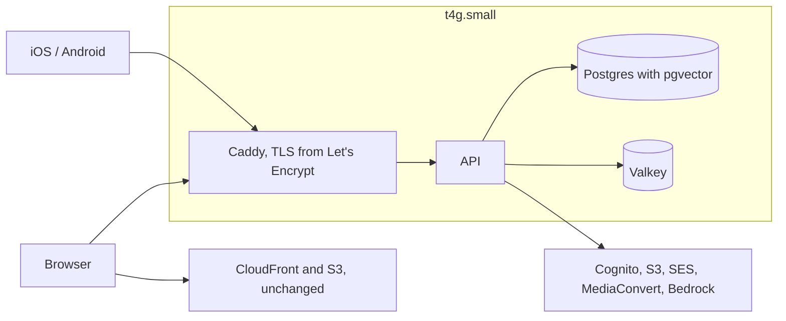

# Infrastructure

Five CloudFormation stacks plus a one-off deploy role, and a sixth stack for mail monitoring that
survives switching topologies. Everything is plain CloudFormation — no SAM, because there are no
Lambda functions to package.

| Stack | Template | Holds |
| --- | --- | --- |
| `digital-health-network` | [network.yaml](network.yaml) | VPC, two public subnets, the three security groups |
| `digital-health-data` | [data.yaml](data.yaml) | RDS PostgreSQL, ElastiCache Valkey, the database secret |
| `digital-health-auth` | [auth.yaml](auth.yaml) | Cognito user pool and one app client per platform |
| `digital-health-mail` | [mail.yaml](mail.yaml) | SES configuration set, mail-event SNS topic, reputation alarms, shared alarm topic |
| `digital-health-app` | [app.yaml](app.yaml) | ECR, ECS Fargate service, ALB, ACM certificate, logs |
| `digital-health-web` | [web.yaml](web.yaml) | S3 bucket, CloudFront distribution |
| `digital-health-deploy-role` | [deploy-role.yaml](deploy-role.yaml) | The role GitHub Actions assumes |
| `digital-health-box` | [box/box.yaml](box/box.yaml) | Optional. One EC2 instance replacing `app` and `data` |

## Two topologies

There are two ways to run this, and only one of them can be live at a time, because both want the
same DNS record.

| | Managed | Single box |
| --- | --- | --- |
| Stands up with | [bootstrap.sh](bootstrap.sh) | [box/bootstrap.sh](box/bootstrap.sh) |
| Runs the API on | Fargate behind an ALB | Containers on one `t4g.small` |
| Database | RDS, automated backups | Postgres container, nightly dump to S3 |
| Cache | ElastiCache Valkey | Valkey container |
| TLS | ACM on the load balancer | Caddy, via Let's Encrypt |
| Cost | ~$82/month | ~$23/month running; ~$1–2 when torn down |
| Survives an instance failure | Yes | No |
| Survives its own teardown | Snapshot, restored by hand | Yes, dumped and restored automatically |

The managed topology is the default and the one to use for anything real. The box exists so a
demonstration environment does not cost eighty dollars a month, and it is explained in full under
[The single-box topology](#the-single-box-topology).

Both share `network`, `auth`, `media`, `web` and `mail`, which are free or near-free at idle.
Switching from managed to box is `./infra/teardown.sh --pause` followed by
`./infra/box/bootstrap.sh`. The mail stack is not deleted on pause, so bounce monitoring and SNS
subscriptions survive the switch in both directions.

## Order

`network` → `data` and `auth` (either order) → `web` → `mail` → `app`.

`app` needs `web`'s URL for CORS and for the links in invitation emails, and `web` needs nothing
from `app`, so `web` goes first. Stacks are wired by export name, and each consumer takes its
producers' stack names as parameters rather than assuming them.

## Deploying

### First, a domain

Everything below needs one. `app.yaml` has no domainless path: `ApiDomainName` is required and the
load balancer always terminates TLS.

The TLD is a deliverability decision, not just a naming one. Invitation email is how clinicians
reach the product at all, and the cheap TLDs carry enough spam reputation to get filtered on
arrival. Stay with `.com`, `.org`, or `.health`.

This deployment uses **simplicityhelp.com**, registered through Route 53 in account
`917993967729`, which creates the hosted zone as part of registration.

Registering is a purchase with contact details attached, so it is not scripted. The console is the
easier path for it:

```
https://us-east-1.console.aws.amazon.com/route53/domains/home#/DomainSearch
```

Route 53's registration API only exists in `us-east-1`, whatever region the rest of this lives in,
and the console follows the same rule. A domain bought elsewhere works just as well, as long as its
nameservers are delegated to a Route 53 zone in this account.

Watch for the ICANN verification email sent to the registrant address. Unanswered, it suspends the
domain after fifteen days.

### Then everything else

```bash
export DB_MASTER_PASSWORD='your-fixed-password'   # required on first deploy only
./infra/bootstrap.sh
```

`DB_MASTER_PASSWORD` is written once into Secrets Manager (`digital-health/prod/database`) and reused on
every snapshot restore, so you never need a post-restore password sync. Omit it on later runs;
CloudFormation keeps the previous value. Never commit it.

That covers the whole sequence: it refuses to run against the wrong account, issues the CloudFront
certificate in `us-east-1` and validates it through Route 53, deploys the six stacks in order,
pushes the first image, verifies the sending domain and writes its DKIM records, and sets the
GitHub variables. It is idempotent, so a failed run can simply be repeated.

That gives `app.simplicityhelp.com`, `api.simplicityhelp.com`, and `no-reply@simplicityhelp.com`.
Override `DOMAIN`, `WEB_HOST`, `API_HOST`, or `MAIL_FROM` to change any of them.

The steps it performs, should you want to do them by hand instead:

```bash
aws cloudformation deploy \
  --template-file deploy-role.yaml \
  --stack-name digital-health-deploy-role \
  --capabilities CAPABILITY_NAMED_IAM \
  --parameter-overrides GitHubOrg=YOUR_ORG GitHubRepository=digital-health-app
```

Then the rest. `network`, `data`, and `auth` change rarely; the pipeline redeploys `app` and `web`
on every push to `main`.

```bash
aws cloudformation deploy --template-file network.yaml \
  --stack-name digital-health-network --capabilities CAPABILITY_IAM

aws cloudformation deploy --template-file data.yaml \
  --stack-name digital-health-data --capabilities CAPABILITY_IAM \
  --parameter-overrides NetworkStackName=digital-health-network \
    DatabaseMasterPassword="$DB_MASTER_PASSWORD"

aws cloudformation deploy --template-file auth.yaml \
  --stack-name digital-health-auth --capabilities CAPABILITY_IAM \
  --parameter-overrides WebBaseUrl=https://app.simplicityhelp.com

aws cloudformation deploy --template-file web.yaml \
  --stack-name digital-health-web --capabilities CAPABILITY_IAM \
  --parameter-overrides WebDomainName=app.simplicityhelp.com CertificateArn=arn:aws:acm:us-east-1:...

aws cloudformation deploy --template-file app.yaml \
  --stack-name digital-health-app --capabilities CAPABILITY_IAM \
  --parameter-overrides \
    NetworkStackName=digital-health-network \
    DataStackName=digital-health-data \
    AuthStackName=digital-health-auth \
    ApiDomainName=api.simplicityhelp.com \
    HostedZoneId=Z... \
    WebBaseUrl=https://app.simplicityhelp.com \
    MailFrom=no-reply@simplicityhelp.com \
    ImageTag=<commit sha>
```

The `app` stack fails on its first deploy if no image has been pushed yet: the ECR repository has
to exist before the pipeline can push, and the service cannot start without an image. Deploy `app`
once with `DesiredCount=0`, push an image, then set it back to 1.

The `app` stack issues and validates its own certificate for `ApiDomainName`, which is why
`CertificateArn` is left unset above and why the pipeline never passes it. Supplying that ARN back
as a parameter flips the condition guarding the certificate, and CloudFormation then tries to
delete one its own listener still references. Only CloudFront's certificate is passed in, because
it has to live in `us-east-1` and a stack cannot create a certificate outside its own region.

## What the pipeline needs

After that first manual round, pushes to `main` redeploy `app` and `web` from
[.github/workflows/ci.yml](../.github/workflows/ci.yml). It authenticates by OIDC, so there is no
AWS key to store — only these repository variables, none of which is a secret:

| Variable | Example |
| --- | --- |
| `AWS_REGION` | `ap-southeast-2` |
| `AWS_DEPLOY_ROLE_ARN` | the `deploy-role` stack's role ARN |
| `API_DOMAIN_NAME` | `api.simplicityhelp.com` |
| `WEB_DOMAIN_NAME` | `app.simplicityhelp.com` |
| `WEB_CERTIFICATE_ARN` | ACM certificate for CloudFront, **in us-east-1** |
| `WEB_BASE_URL` | `https://app.simplicityhelp.com` |
| `HOSTED_ZONE_ID` | the Route 53 zone holding both records |
| `MAIL_FROM` | `no-reply@simplicityhelp.com`, verified in SES |

The job runs under a `production` GitHub environment, so approvals and branch restrictions are
configured there rather than in the workflow.

Deploys are keyed on the commit sha rather than `latest`, which is what makes a rollback a matter
of redeploying an older sha. `config.json` is written from stack outputs after the bundle is built,
so the same artefact could be promoted to another environment by writing a different file.

## Things worth knowing before changing any of this

**Public subnets, no NAT Gateway.** A NAT Gateway costs about 32 US dollars a month, roughly a
third of the pilot's whole infrastructure budget. The Fargate tasks are unreachable because their
security group admits nothing but the load balancer, not because of where they sit. Revisit before
this service holds anything more sensitive than de-identified reflections.

**Fixed database password in Secrets Manager.** The master password is set once via
`DB_MASTER_PASSWORD` when standing the data stack up, stored at
`digital-health/<env>/database`, and injected into ECS by secret name. RDS does not rotate it,
which means a snapshot restore can reuse the same credentials without a sync step. The password
never appears in git or the pipeline; only in Secrets Manager and in your shell when you pass
`DB_MASTER_PASSWORD`.

**CloudFront certificates must be in us-east-1**, whichever region the rest of this is deployed to.
The `web` stack takes the ARN as a parameter rather than issuing one, because a stack cannot create
a certificate outside its own region.

**Retention.** The user pool, the S3 bucket, and the database survive stack deletion — `Retain` on
the first two, `Snapshot` on the database. Deleting a stack should never be what loses a
clinician's credentials or their reflections.

## Alarms

The mail stack raises a `digital-health-<env>-alarms` SNS topic. The app stack publishes six
infrastructure alarms to it — the API returning 5xx, having no healthy target, having an unhealthy
one for ten minutes, the database low on storage or busy, and the cache near full — and the mail
stack publishes two reputation alarms for bounces and complaints.

Alarm descriptions say what a person would notice rather than which metric moved, because the
description is what arrives in the email at an inconvenient hour.

**Set the `ALARM_EMAIL` repository secret, then confirm the subscription.**

```bash
gh secret set ALARM_EMAIL --body 'alerts@example.com'
```

A secret and not a variable, only so it is masked. Variables are printed verbatim into the workflow
log and this repository is public — `MailFrom` is already legible in it. An alerting inbox in a
public log is an invitation to spam.

The value only reaches AWS on the next deploy, so push something or re-run the workflow afterwards.

Then **confirm the subscription**. AWS emails that address a link and delivers nothing until
somebody clicks it. The stack reports success regardless, so an unconfirmed subscription looks
exactly like a working one. There are two subscriptions — one on the alarm topic and one on the
mail-events topic:

```bash
aws sns list-subscriptions-by-topic --topic-arn "$(aws cloudformation describe-stacks \
  --stack-name digital-health-mail \
  --query "Stacks[0].Outputs[?OutputKey=='AlarmTopicArn'].OutputValue" --output text)" \
  --query 'Subscriptions[*].SubscriptionArn' --output text
```

`PendingConfirmation` there means nobody is being told anything.

With `ALARM_EMAIL` unset the alarms still exist and still record state; they simply have no
subscriber, which is a reasonable interim position but not a monitored one.

To prove the path end to end without waiting for an outage:

```bash
aws cloudwatch set-alarm-state --alarm-name digital-health-prod-api-errors \
  --state-value ALARM --state-reason "testing the notification path"
```

## Mail

Invitations are the only email this system sends. They go through SES from
`no-reply@simplicityhelp.com`, under a configuration set named `digital-health-<env>` that the mail
stack creates and both topologies pass to the API as `MAIL_CONFIGURATION_SET`.

The configuration set is what makes failures visible. Bounces, complaints, rejections and rendering
failures are published to a `digital-health-<env>-mail-events` SNS topic, subscribed by the same
`ALARM_EMAIL` address and needing the same confirmation click. Deliveries and opens are deliberately
not published: every invitation would generate one and bury the events that need a person.

Two alarms watch the account's reputation, because these are the numbers AWS acts on. A bounce rate
above 5 per cent gets a sender reviewed and above 10 per cent suspended; for complaints the
tolerance is 0.1 per cent. The alarms fire below those, at 5 per cent and 0.1 per cent respectively,
so there is warning before AWS intervenes.

Sending outside a configuration set still delivers, so `MAIL_CONFIGURATION_SET` is optional and
empty locally. But then nothing reports a bounce, and the topic and both alarms stay silent no
matter how much mail fails.

Deploy the mail stack with [bootstrap.sh](bootstrap.sh), or let the pipeline do it on the next
merge. It is never deleted by [teardown.sh](teardown.sh) `--pause`.

**The account is still in the SES sandbox.** Until production access is granted, invitations only
reach addresses verified by hand, and never a real clinician — which surfaces as a failed invitation
rather than a missing email. `bootstrap.sh` prints this on every run. The request is drafted in
[ses-production-access.md](ses-production-access.md).

```bash
aws sesv2 get-account --query ProductionAccessEnabled
```

## The single-box topology

```bash
./infra/teardown.sh --pause    # remove the load balancer, Fargate, RDS and ElastiCache
./infra/box/bootstrap.sh       # stand up the instance that replaces them
```

One `t4g.small` in the existing public subnet running four containers — the API, Postgres, Valkey
and Caddy — against the same Cognito pool, the same buckets and the same image. The pipeline builds
`linux/arm64` already, so nothing about the artefact changes.



### What it costs

| | Monthly |
| --- | --- |
| `t4g.small` | $15.48 |
| One public IPv4 address | $3.65 |
| 30 GB gp3 | $2.88 |
| Route 53, ECR, S3, CloudFront, Cognito, SES | ~$1.00 |
| **Running continuously** | **~$23** |
| **Torn down** (`teardown.sh`) | **~$1–2** (shared stacks only) |

Against ~$82 for the managed topology. The largest single saving is not the compute: it is the four
public IPv4 addresses the load balancer and Fargate tasks hold, which cost $14.60 a month between
them, more than the instance that replaces the lot.

`t4g.micro` is half the price and will not work. The budget is about 675 MB of heap, 400 MB of
Postgres, 80 MB of Valkey, 30 MB of Caddy and 200 MB of operating system.

### Taking it down

```bash
./infra/box/teardown.sh
```

Deletes the CloudFormation stack, the configuration bucket, and Parameter Store entries. Shared
stacks — network, auth, web, media and mail — are untouched.

**The database survives.** Before it deletes anything, `teardown.sh` starts the instance if it is
stopped, runs `backup.sh` for a dump current as of the teardown rather than last night, and copies
every dump in the configuration bucket to `digital-health-box-backups-<env>-<account>`. Nothing in
either script deletes that bucket, and unlike the `backups/` prefix of the configuration bucket it
carries no lifecycle rule: it holds the only surviving copy of a box that no longer exists, and
there is no length of idle after which discarding it is right. If the dump cannot be taken —
Session Manager unreachable, `backup.sh` failing — teardown stops and deletes nothing.

`bootstrap.sh` then restores the newest dump it finds there onto the new box, before the health
check. So the round trip costs whatever was written between the dump and the teardown, not
everything. A brand new account has nothing archived and starts empty, which is the same thing said
two ways.

Restoring is guarded by a `restored-from` marker in the configuration bucket, so running
`bootstrap.sh` twice against a live box does not replay the dump over what the box has done since.
The marker dies with the configuration bucket, which is to say with the box.

To stop paying without deleting, `ec2 stop-instances` still bills for the Elastic IP and gp3 root
volume (~$8/month) but keeps the live database on disk, so nothing is dumped or replayed. Teardown
is the cheaper idle (~$1–2/month) and now the safe one.

### Operating it

There is no SSH. Shell access is Session Manager, which needs no inbound port:

```bash
aws ssm start-session --target "$instance"
sudo docker compose -f /opt/box/docker-compose.yml logs -f app
sudo /opt/box/restore.sh --latest      # restore the most recent nightly dump
```

Boot problems land in `/var/log/box-bootstrap.log`.

### Things worth knowing before relying on it

- **The database is a container on one disk.** No failover, no read replica, no point-in-time
  recovery. [box/backup.sh](box/backup.sh) dumps to S3 nightly and keeps fourteen days, so the
  recovery point is up to twenty-four hours old. An instance lost to a crash rather than to
  `teardown.sh` loses everything since the last nightly dump; teardown itself takes a fresh one.
- **Postgres is `pgvector/pgvector:pg17`, not the stock image.** `V8__assistant.sql` opens with
  `CREATE EXTENSION vector` and the assistant stores 1024-dimension embeddings behind an HNSW
  index. RDS supplies that extension; plain `postgres:17` does not, and Flyway fails on the first
  migration with the application restart-looping behind it.
- **Certificates come from Let's Encrypt**, which rate-limits five failures per hostname per hour.
  The Caddy data volume holds the certificate, so losing that volume during a crash loop can lock
  the domain out for an hour.
- **Both topologies cannot be live together.** They would fight over the API's DNS record.
  `box/bootstrap.sh` refuses to run while the app stack still owns it.
- **The configuration bucket is created by the script, not the stack.** The instance reads its
  compose file from it at first boot, so a bucket created in the same deploy would still be empty
  when the instance needed it. It also means a stack delete cannot orphan it, which is exactly the
  trap the retained buckets below fall into.

## Taking it down

```bash
./infra/teardown.sh --dry-run     # print every destructive call, make none
./infra/teardown.sh --pause       # stop paying, keep everything that is free
./infra/teardown.sh               # everything except the retained resources
./infra/teardown.sh --purge       # everything, including accounts and uploads
```

**Teardown is not reversible, and the retention policies are why.** Three resources survive a
plain teardown, which sounds safe and is a trap:

- The **Cognito user pool** is `Retain`. It stays, but nothing manages it, and a later
  `bootstrap.sh` creates a *new* pool with new ids. Every clinician's account is orphaned — they
  cannot sign in, and their memberships point at a pool nothing reads.
- **Both S3 buckets** are `Retain` and named deterministically
  (`digital-health-web-<env>-<account>`). A later `bootstrap.sh` **fails**: the bucket exists and
  CloudFormation will not adopt it. Letting CloudFormation generate the names instead would fix
  this, at the cost of replacing both buckets once; worth doing while the only contents are test
  uploads, and much harder once they hold real video.
- The **database** leaves a final snapshot. Restoring it is manual.

So tearing down and bootstrapping again does not restore what you had. It produces a failed deploy,
and then an empty product whose users cannot log in.

`--purge` removes those three as well, which at least is honest: nothing to collide with, nothing
to restore, no accounts.

### If the goal is only to stop paying

Use `--pause`. Of roughly $74 a month, the load balancer, database, cache and Fargate task are 96%,
and all four live in the app and data stacks — so those are the only two `--pause` deletes. About
$0.70 a month remains: fifty cents for the Route 53 hosted zone, twenty for the database snapshot,
which bills on the 1.6GB used rather than the 20GB allocated.

Everything else is kept because idle it is free, and deleting it would cost something real:

| Kept | Idle cost | Why deleting it would hurt |
| --- | --- | --- |
| Cognito pool | free below 10k users | new pool means new ids, and the shipped iOS and Android builds stop working |
| VPC and subnets | free without a NAT gateway | nothing gained |
| Deploy role | free | it is what CI authenticates with, so a merge could not even start |
| Web and media | S3 and CloudFront, billed per request | the DNS record and distribution take ~15 minutes to return, and the retained buckets pile up |
| Container images | a few cents | `bootstrap.sh` needs an image to start the task; without one you need a full CI run first |

**The infrastructure comes back. The data does not.** `bootstrap.sh` creates an empty database and
never reads the snapshot. Once the data stack uses a fixed password in Secrets Manager, restore
pre-pause data with:

```bash
./infra/restore-rds.sh --latest-pause-snapshot
# or: ./infra/restore-rds.sh --snapshot digital-health-data-snapshot-database-...
```

That stops the API, replaces the RDS instance from the snapshot with the password already in
Secrets Manager, and starts the API again. Use `--dry-run` to print the steps first.

**Migrating from RDS-managed passwords.** If the data stack still uses `ManageMasterUserPassword`
(an `rds!db-…` secret), redeploy in this order:

```bash
export DB_MASTER_PASSWORD='your-fixed-password'
aws cloudformation deploy --template-file infra/data.yaml \
  --stack-name digital-health-data --capabilities CAPABILITY_IAM \
  --parameter-overrides NetworkStackName=digital-health-network \
    DatabaseMasterPassword="$DB_MASTER_PASSWORD"
aws cloudformation deploy --template-file infra/app.yaml \
  --stack-name digital-health-app --capabilities CAPABILITY_IAM \
  --parameter-overrides ...   # same overrides as bootstrap.sh / the pipeline
```

The app stack now reads the secret by name (`digital-health/prod/database`), not by CloudFormation
export, so the secret can be recreated without a coupled two-stack change. RDS is modified in place
to the fixed password; the old `rds!db-…` secret can be deleted afterwards.

`--dry-run` is the only way to inspect the destructive path without a disposable environment to
run it against. Every destructive call is routed through one `run` helper, so a deletion added
later has to be written as `run ...` to work at all — which is what stops the dry run quietly
under-reporting.

Deletion order is the reverse of creation because CloudFormation refuses to delete a stack whose
exports are still imported. That is the same rule that rolled back a cache change in August.

## Checking a change

```bash
cfn-lint infra/*.yaml
```

## Cost

Roughly 65 to 85 US dollars a month: Fargate 0.5 vCPU and 1 GB on Graviton (~14), ALB (~18), RDS
`db.t4g.micro` (~15), ElastiCache `cache.t4g.micro` (~12), S3 and CloudFront (~5). Cognito is free
below 10,000 monthly active users.

Every compute line is arm64. The task definition is Graviton, the pipeline builds on an
`ubuntu-24.04-arm` runner, and `db.t4g` and `cache.t4g` are Graviton too — so nothing is emulated
anywhere and the architecture in production is the one developers run locally.
